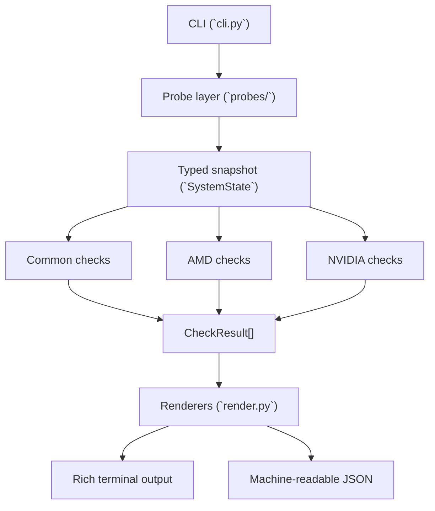

# Architecture

`davinci-resolve-checker` is a small Python CLI that inspects the local machine, normalizes the collected facts into a typed system model, runs compatibility rules, and renders the results as either terminal output or JSON.

See [`README.md`](README.md) for user-facing setup and usage, [`CONTRIBUTING.md`](CONTRIBUTING.md) for the contribution workflow, and [`docs/adr/0001-layered-checker-flow.md`](docs/adr/0001-layered-checker-flow.md) for the main architecture decision record behind the current layout.

## System Flow

## Core Components

### CLI

- Entry point: `src/davinci_resolve_checker/cli.py`
- Parses `--pro`, `--fail-fast`, and `--json`
- Orchestrates one full run: probe, check, render, exit with a process status

### Probe Layer

- `probes/system.py` collects distro, chassis, package, and environment details
- `probes/gpu.py` inspects PCI devices and OpenGL renderer information
- `probes/opencl.py` parses `clinfo --json` output into OpenCL platform objects
- `probes/__init__.py` assembles the full `SystemState`

The probe layer is the only place that should talk to the host system directly.

### Typed Models

- `models.py` defines the stable data contracts used across the project
- `SystemState` is the normalized machine snapshot passed into the rules engine
- `CheckResult` is the normalized result returned by every compatibility check

These models are the seam between host inspection and business logic.

### Compatibility Checks

- `checks/common.py` contains platform-neutral rules such as distro, GPU presence, renderer, and OpenCL validation
- `checks/amd.py` contains AMD open-stack and AMD Pro rules
- `checks/nvidia.py` contains NVIDIA-specific rules
- `checks/__init__.py` sequences checks and applies `fail_fast`

Checks should stay pure over `SystemState`: they inspect typed state and return `CheckResult` values without printing or shelling out.

### Rendering

- `render.py` is responsible for presentation only
- `render_text()` uses Rich for human-readable output
- `render_json()` emits a stable JSON document intended for automation

## Technology Stack

- Python 3.10+
- `cyclopts` for CLI parsing
- `pydantic` for typed models and serialization
- `rich` for terminal output
- `pylspci` for PCI enumeration
- `pytest` and `pytest-mock` for tests
- `ruff` for linting and formatting
- `tox` plus `uv` for multi-environment validation

## Architecture Invariants

- Probe first, then check: rules must operate on a complete `SystemState`
- Checks do not mutate state
- Renderers do not make compatibility decisions
- CLI exit status is derived from `CheckResult.status`
- JSON output should stay predictable for downstream tooling
- Tests should exercise parsing and rule behavior without depending on the host machine

## Key Design Decisions

### Normalize host facts before applying rules

The project shells out to tools such as `expac`, `glxinfo`, `eglinfo`, and `clinfo`, but that host-specific behavior is isolated in the probe layer. This keeps the rule code testable and easier to extend.

### Separate common rules from vendor-specific rules

Global failures such as unsupported distributions or missing usable OpenCL platforms are handled before AMD or NVIDIA checks. Vendor-specific logic only runs when that vendor is present.

### Support both human and automation consumers

The Rich text output is optimized for interactive diagnosis, while the JSON renderer exposes the same results in a structured form for scripts and agents.

## Known Concerns

- GPU codename detection is heuristic-based, especially for pre-Vega AMD handling
- The tool is intentionally focused on Arch-based Linux distributions
- Probe reliability depends on external system utilities being installed and returning parseable output
- Hardware compatibility rules may need updates as new GPUs, drivers, and package names appear

## Packaging and Release Flow

- Local development uses `uv` and `tox`
- GitHub Actions runs tests, lint, packaging smoke tests, and dependency audit checks
- Tagged releases build artifacts and publish to PyPI through `.github/workflows/release.yml`

## Glossary

- **OpenCL**: the compute API DaVinci Resolve expects for supported GPU acceleration paths
- **ROCm**: AMD's open compute stack used by the AMD open-stack path
- **AMD Pro**: proprietary AMD userspace components used by the `--pro` path
- **GL vendor / renderer**: the active OpenGL implementation reported by `glxinfo` or `eglinfo`
- **Fail fast**: stop emitting results after the first failing check
